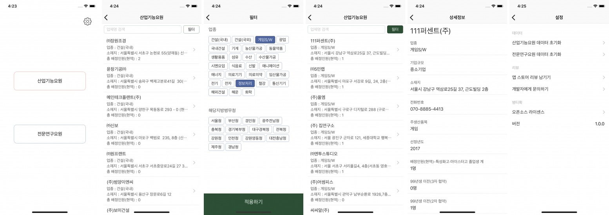

# :man: 병티확 - 병역특례 티오 확인

병역특례 업체 및 병역특례 업체에 배정된 현역 티오 확인하는 어플

## About
병역특례 업체들을 학인하기 위해서는 병무청 홈페이지에 들어가서 확인해야하고. 
더군다나 병역특례 업체에 배정된 현역 티오들을 확인하기 위해서는 
병무청에서 업로드한 엑셀파일을 통해서 확인할 수 한다. 
필요한 정보를 확인하는데 불편함을 느껴게 되어, 만들게 되었습니다. 
모바일에서 손 쉽고 빠르게 병역특례 업체들과 병역특례 업체의 정보, 
병역특례 업체에 배정된 티오까지 확인할 수 있게 만들었습니다. 

## Concept

- 병역특례 업체들은 `TableView` 를 통해 나열됩니다.
- `TextField` 의 입력을 통해서 병역특례 업체를 검색할 수 있습니다.
- 필터 기능을 통해 병역특례 업체를 업종, 지역으로 필터링 할 수 있습니다.
- `TableViewCell` 을 터치하면 해당 병역특례 업체의 여러 정보들과 배정된 현역 티오를 확인할 수 있습니다. 

## Used Open Source
- `ChameleonFramework/Swift` : https://github.com/viccalexander/Chameleon
- `Then` : https://github.com/devxoul/Then
- `SnapKit` : https://github.com/SnapKit/SnapKit
- `NVActivityIndicatorView`: https://github.com/ninjaprox/NVActivityIndicatorView
- `AlignedCollectionViewFlowLayout`: https://github.com/mischa-hildebrand/AlignedCollectionViewFlowLayout
- `RxSwift`: https://github.com/ReactiveX/RxSwift
- `RxCocoa`: https://github.com/ReactiveX/RxSwift/tree/master/RxCocoa
- `RealmSwift` : https://github.com/realm/realm-cocoa
- `Firebase/Core`: https://github.com/firebase/firebase-ios-sdk/tree/master/Firebase/Core
- `Firebase/Database`: https://github.com/firebase/firebase-ios-sdk/tree/master/Firebase/Database
- `ObjectMapper`: https://github.com/tristanhimmelman/ObjectMapper
- `Carte`: https://github.com/devxoul/Carte

## Update
- 0.5 (2018.04.25)
    - 기본적인 기능 개발 완료, 기획과 디자인 추가 보강해서 릴리즈 예정
- 0.9 (2019.04.20)
    - 컨셉대로 개발 완료 했지만, 기능 부족으로 인해 심사 거부된 상태. (보류 상태)

## Review
- 0.5 (2018.04.25)
    - ['병티확 - 병역특례 티오 확인' 프로젝트 1차 리뷰](http://jhyejun.com/blog/review-military-to-ver-0.5){:target="_blank"}
- 0.9 (2019.04.20)
    - 작성 중

## Author :octocat:
**Hyejun Jang**
- hyejun417@gmail.com :email:
